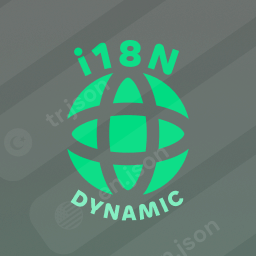

# Move All Package to [productdevbookcom](https://github.com/productdevbookcom)
All packages started to be moved here separately.

# 👋 Welcome to huntersofbook

This repo was created with the aim of developing the vue ecosystem as well as giving back to the open-source world what we learned from our own project. Our priority is to bring our inner work back to the vue ecosystem.

As a sponsor, you can support us and our software that we have developed on books.
 

<table>
<thead>
<tr>
<th width="2000" colspan="2">
</th>
</tr>
</thead>
<tbody>
<h1>Typescript Package</h1>
<tr>
  <td width="80" align="center" valign="top">
     
    
  </td>
  <td valign="top">
    <h3>i18n</h3>
    

      
      
      
    

    

      It's basically a tool that takes a template with translation keys and syncs them to the given language. You can directly connect the outputs to the i18n libraries you use.

     <a href="https://opensource.huntersofbook.com">The documentation</a>
    

    

  </td>
</tr>
</tbody>
</table>

<table>
<thead>
<tr>
<th width="2000" colspan="2">
</th>
</tr>
</thead>
<tbody>
<h1>Nuxt 3 Packages</h1>
<tr>
  <td width="80" align="center" valign="top">
     
    
  </td>
  <td valign="top">
    <h3>Naive UI</h3>
    

      
      
      
    

    

       <a href="https://opensource.huntersofbook.com">The documentation</a> 
    

  </td>
</tr>
</tbody>
</table>

## Local Development

...soon

## Follow us

  &nbsp;&nbsp;&nbsp;&nbsp;

## License

[MIT](./LICENSE)
